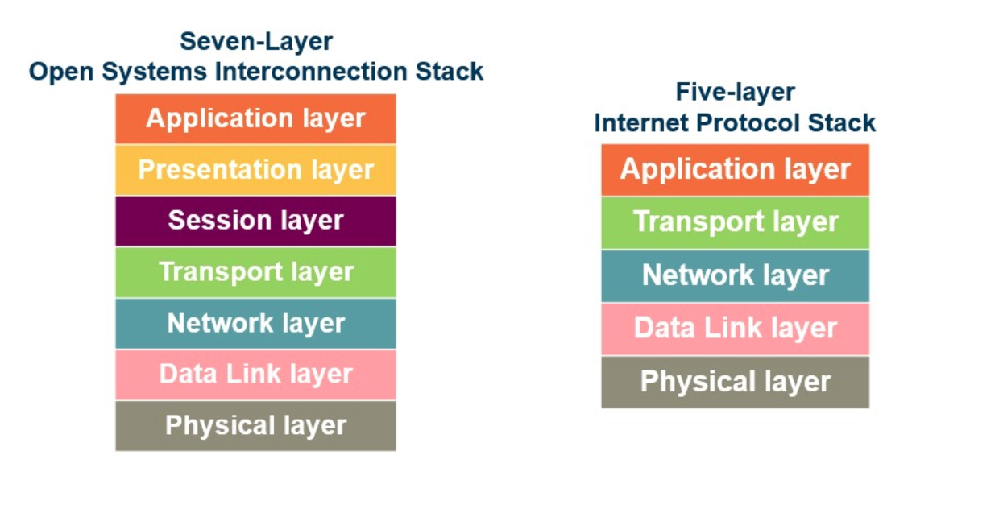
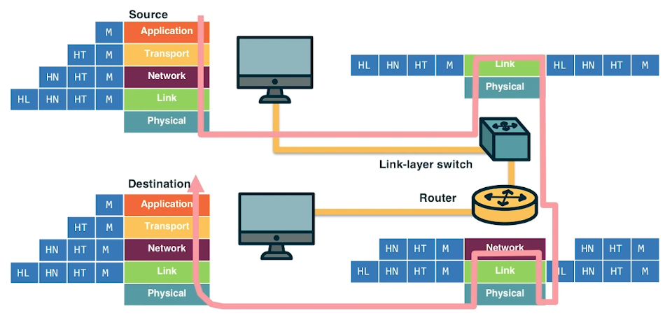

# Internet Architecture

## Layered Architecture 

OSI Seven-Layer and IPS Five-layer:

Advantages of having a layered network:

- scalability.
- modularity.
- flexibility to add or delete components, which make for cost-effective implementations. 

Disadvantages:

- Some layers' functionality depends on the information from other layers, which can violate the goal of layer separation.
- One layer may duplicate lower-layer functionalities. For example, the functionality of error recovery can occur in lower layers but also in upper layers as well.
- Some additional overhead that is caused by the abstraction between layers.

Open system interconnection (IOS) Seven-Layer:

- **Application Layer**
  - The application layer includes multiple protocols. Here are some of the most popular protocols:
    - HTTP (web)SMTP (e-mail)
    - FTP (transfers files between two end hosts)
    - DNS (translates domain names to IP addresses)
  - The same is true for the interface through which it is accessed and the protocol that is implemented. At the application layer, we refer to the packet of information as a **message**.
  - Service: whatever you want;
  - Interface: whatever you want;
  - Protocol: Whatever you want;
  - Example: turn on iphone and look the list of apps.
  
- **Presentation Layer**:
  - The presentation layer plays the intermediate role of formatting the information that it receives from the layer below and delivering it to the application layer.
  - Service: Convert data between different representations;
  - Interface: It depends..;
  - Protocol:
    - Define data formats;
    - Apply transformation rules;
  - Example:
    - big endia to little endia
    - Ascii to Unicode

- **Session Layer**: The session layer is responsible for the mechanism that manages the different transport streams that belong to the same session between end-user application processes.
  - Service
    - Access management
    - Synchronization
  - Interface: It depends..;
  - Protocol:
    - Token management;
    - Insert checkpoints;
  - Example: In the case of a teleconference application, it is responsible to tie together the audio stream and the video stream.

- **Transport Layer**: end-to-end communication between end hosts. In this layer, 
  - there are two transport protocols:
    - Transmission Control Protocol(TCP)
    - User Datagram Protocol(UDP)
    - The services that TCP offers include a connection-oriented service to the applications that are running on the layer above, guaranteed delivery of the application-layer messages, flow control which, in a nutshell, matches the sender’s and receiver’s speed, and a congestion-control mechanism, so that the sender slows its transmission rate when it perceives the network to be congested. On the other hand, the UDP protocol provides a connectionless, best-effort service to the applications that are running in the layer above without **reliability**, **flow**, or **congestion control**. At the transport layer, we refer to the packet of information as a **segment**.
  - Service
    - Multiplexing/demultiplexing
    - Congestion control (TCP)
    - Reliable, in-order Deliver (TCP)
  - Interface: Send message to a destination;
  - Protocol:
    - Port numbers;
    - Reliability error correction;
    - Flow-control information
  - Example: TCP/UDP

- **Network Layer** : move data from address to another address
  - In this layer, we refer to the packet of information as a **datagram**. The network layer is responsible for moving datagrams from one Internet host to another. A source host sends the segment (along with the destination address) from the transport layer to the network layer. The network layer is responsible for delivering the datagram to the transport layer at the destination host. At the network layer, we have the Internet Protocol (IP) and the routing protocols. IP is often referred to as "the glue" that binds the Internet together. All Internet hosts and devices that have a network layer must run the IP protocol. It defines the fields in the datagram and how the source/destination hosts and the intermediate routers use these fields so that the datagrams that a source Internet host sends reach their destination. It is the routing protocols that determine the routes that the datagrams can take between sources and destinations.
  - Service
    - Deliver packets across the networks
    - Handle fragmentation/reassembly
    - Packet scheduling
    - Buffer management
  - Interface: Send one packet to as specific destination
  - Protocol:
    - Define globally unique addresses
    - Maintain routing tables
  - Example: IP, IPv6

- **Data Link Layer**: In this layer, we refer to the packets of information as **frames**. Some example protocols in this layer include Ethernet, Point-to-Point Protocol (PPP), and WiFi.
  - Service
    - Data framing: boundaries between packets
    - Media access control(MAC)
    - Per-hop reliability and flow-control
  - Interface: Send one packet between two hosts connected to the same media
  - Protocol:
    - Physical addressing(e.g. Mac address)
  - Example: Ethernet, Wifi, DOCSIS

- **Physical Layer**: The physical layer facilitates the interaction with the actual hardware. It is responsible for transferring bits within a frame between two nodes that are connected through a physical link. The protocols in this layer again depend on the link and on the actual transmission medium of the link. One of the main protocols in the data link layer, Ethernet, has different physical layer protocols for twisted-pair copper wire, coaxial cable, and single-mode fiber optics.
  - Service
    - Move infomration between two systems connected by a physical link.
  - Interface: Specific how to send one **bit**
  - Protocol:
    - Encoding scheme for one bit
    - Voltage levels
    - Timing of signals
  - Example: coaxial cable, fiber optics, radio frequency transmitters

## Encapsulation and De-encapsulation

The sending host sends an application layer message M to the transport layer. The transport layer receives the message, and it appends the transport layer header information (HT). The application message, along with the transport layer header, is called a segment (or transport layer segment). The segment thus encapsulates the application layer message. This added information can help the receiving host inform the receiver-side transport layer about which application to deliver the message to, perform error detection, and determine whether bits in the message have been changed along the route. 

The segment is then forwarded to the network layer, which, in turn, adds its own network header information (HN). The entire combination of the segment and the network header is called a datagram. We say that the datagram encapsulates the segment. The header information that the network layer appends includes the source and destination addresses of the end hosts. The same process continues for the data link layer, which in turn appends its own header information (HL). The message at the data link layer is called a frame, which is transmitted across the physical medium. At each layer, the message is a combination of two parts: the payload, which is the message from the layer above, and the new appended header information. At the receiving end, the process is reversed, with headers being stripped off at each layer. This reverse process is known as de-encapsulation.

**Intermediate devices and encapsulation**
The path that connects the sending and the receiving hosts may include intermediate layer-3 devices, such as routers, and layer-2 devices, such as switches. We will see later how switches and routers work, but for now, we note that both routers and layer-2 switches implement protocol stacks similarly to end-hosts. The difference is that routers and layer-2 switches do not implement all the layers in the protocol stack; routers implement layers one to three (physical, data link, and network), and layer-2 switches implement layers one to two (physical and data link). So, going back to our diagram, when the data leaves the sending host and is received by the layer-2 switch, the switch implements the same process of de-encapsulation to process the data and encapsulation to send the data forward to the next device. 

**A design choice**
We note again that end-hosts implement all five layers while the intermediate devices do not. This design choice ensures that the Internet architecture puts much of its complexity and intelligence at the edges of the network while keeping the core simple. Next, we will look deeper into the so-called end-to-end principle.