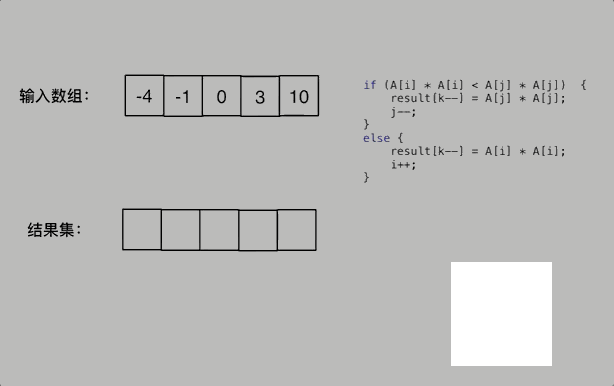

# Two Pointers

## fast and slow pointers

Definition:

- **fast pointer**: search the element for the new array. The new array should not include the target element.
- **slow pointer**: point the index in updated new array.

Problem:

[LC27 remove element](https://leetcode.com/problems/remove-element/description/)

```cpp
class Solution {
public:
    int removeElement(vector<int>& nums, int val) {
        int slowIndex = 0;
        for (int fastIndex = 0; fastIndex < nums.size(); fastIndex++) {
            if (val != nums[fastIndex]) {
                nums[slowIndex++] = nums[fastIndex];
            }
        }
        return slowIndex;
    }
};
```

## 相向双指针

- binary search 也应用了相同的办法，left， right 双指针相向运动

Problem：

[LC977 squares of a sorted Array](https://leetcode.com/problems/squares-of-a-sorted-array/description/)


```cpp
class Solution {
public:
    vector<int> sortedSquares(vector<int>& nums) {
        vector<int> res(nums.size());

        int left = 0;
        int right = nums.size() - 1;

        for (int i = nums.size() - 1; i >= 0; i--) {
            int temp;
            if (abs(nums[left]) < abs(nums[right])) {
                temp = nums[right];
                right--;
            } else {
                temp = nums[left];
                left++;
            }
            res[i] = temp * temp;
        }
        return res;
    }
};
```


## 同相双指针

- Sliding Window
[LC209 Minimum Size Subarray Sum](https://leetcode.com/problems/minimum-size-subarray-sum/description/)

所谓滑动窗口，**就是不断的调节子序列的起始位置和终止位置，从而得出我们要想的结果**

过程：


在本题中实现滑动窗口，主要确定如下三点：

- 窗口内是什么？
- 如何移动窗口的起始位置？
- 如何移动窗口的结束位置？
- 窗口就是 满足其和 ≥ s 的长度最小的 连续 子数组。

窗口的起始位置如何移动：如果当前窗口的值大于等于s了，窗口就要向前移动了（也就是该缩小了）。
窗口的结束位置如何移动：窗口的结束位置就是遍历数组的指针，也就是for循环里的索引。


```cpp
class Solution {
public:
    int minSubArrayLen(int target, vector<int>& nums) {
        int res = INT32_MAX;
        int i = 0;
        int sum = 0;
        int subLength = 0;

        for (int j = 0; j < nums.size(); j++) {
            sum += nums[j];            //增加window
            while (sum >= target) {   //缩小window
                subLength = j - i + 1;
                res = res < subLength ? res: subLength;
                sum -= nums[i++];
            }
        }
        return res == INT32_MAX ? 0 : res;
    }
};
```

## 背向双指针