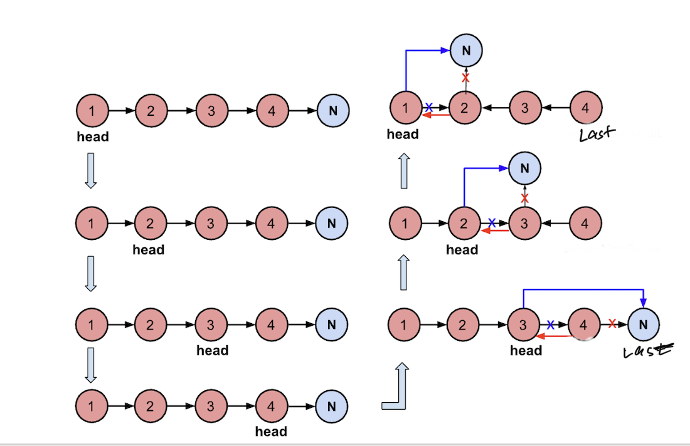

# Linklist

## Definition

in c++

```
// 单链表
struct ListNode {
    int val;  // 节点上存储的元素
    ListNode *next;  // 指向下一个节点的指针
    ListNode(int x) : val(x), next(NULL) {}  // 节点的构造函数
};
```

通过自己定义构造函数初始化节点：
```cpp
ListNode* head = new ListNode(5);
```

使用默认构造函数初始化节点：
```cpp
ListNode* head = new ListNode();
head->val = 5;
```

所以如果不定义构造函数使用默认构造函数的话，在初始化的时候就不能直接给变量赋值！


## Design Linkedlist

[LC707 Design Linked List](https://leetcode.com/problems/design-linked-list/description/)

```cpp
class MyLinkedList {
    struct LinkedNode {
        int val;
        LinkedNode* next;
        LinkedNode(int val): val(val), next(nullptr) {}
    };
    LinkedNode* dummy;
    int size;

public:
    
    MyLinkedList() {
        dummy = new LinkedNode(0);
        size = 0;
    }
    
    int get(int index) {
        if (index > size - 1 || index < 0) {
            return -1;
        }

        LinkedNode* cur = dummy->next;
        while (index--) {
            cur = cur->next;
        }
        return cur->val;
    }
    
    void addAtHead(int val) {
        LinkedNode* newNode = new LinkedNode(val);
        newNode->next = dummy->next;
        dummy->next = newNode;
        size++;

    }
    
    void addAtTail(int val) {
        LinkedNode* newNode = new LinkedNode(val);
        LinkedNode* cur = dummy;
        while (cur->next != nullptr) {
            cur = cur->next;
        }
        cur->next = newNode;
        newNode->next = nullptr;
        size++;
    }
    
    void addAtIndex(int index, int val) {
        if (index > size) return;
        if (index<0) index = 0;

        LinkedNode* cur = dummy;
        LinkedNode* newNode = new LinkedNode(val);
        while (index--) {
            cur = cur->next;
        }
        newNode->next = cur-> next;
        cur->next = newNode;
        size++;
    }
    
    void deleteAtIndex(int index) {
        if (index >= size || index < 0) {
            return;
        }
        LinkedNode* cur = dummy;
        while (index--) {
            cur = cur->next;
        }
        LinkedNode* tmp = cur->next;
        cur->next = cur->next->next;
        delete tmp;
        tmp=nullptr;
    }
};

/**
 * Your MyLinkedList object will be instantiated and called as such:
 * MyLinkedList* obj = new MyLinkedList();
 * int param_1 = obj->get(index);
 * obj->addAtHead(val);
 * obj->addAtTail(val);
 * obj->addAtIndex(index,val);
 * obj->deleteAtIndex(index);
 */
```

## Operation 

### Remove

[LC203 Remove Linked List Elements](https://leetcode.com/problems/remove-linked-list-elements/description/)

```cpp
/**
 * Definition for singly-linked list.
 * struct ListNode {
 *     int val;
 *     ListNode *next;
 *     ListNode() : val(0), next(nullptr) {}
 *     ListNode(int x) : val(x), next(nullptr) {}
 *     ListNode(int x, ListNode *next) : val(x), next(next) {}
 * };
 */
class Solution {
public:
    ListNode* removeElements(ListNode* head, int val) {
        ListNode* dummy = new ListNode(0);
        dummy->next = head;
        ListNode *prev = dummy, *curr=head, *toDelete = nullptr;

        while (curr != nullptr) {
            if (curr->val == val) {
                prev->next = curr->next;
                toDelete = curr;
            } else {
                prev = curr;
            }
            curr = curr->next;
            if (toDelete != nullptr) {
                delete toDelete;   // in C++ remember to garbage collection
                toDelete = nullptr;
            }
        }
    }
}     
```

### Reversed a Linkedlist

[LC106 Reverse Linked List](https://leetcode.com/problems/reverse-linked-list/description/)

Iteration method

```cpp
class Solution {
public:
    ListNode* reverseList(ListNode* head){
        ListNode* cur = head;
        ListNode* pre = NULL;
        ListNode* temp;

        while (cur) {
            temp = cur->next;
            cur->next = pre;
            pre = cur;
            cur = temp;
        }
        return pre;
    }
}
```

Recursive method 1

It is the same idea as the iteration method

```cpp
class Solution {
public:
    Listnode* reverse(ListNode* pre, ListNode* cur) {
        if (cur == NULL) return pre;
        ListNode* temp;
        temp = cur->next;
        cur->next = pre;
        return reverse(cur, temp)

    }
    Listnode* reverseList(ListNode* head) {
        return reverse(NULL, head)
    }
}
```

Recursive method 2
It starts from back.


```cpp
class Solution {
public:
    ListNode* reverseList(ListNode* head) {
        // 边缘条件判断
        if(head == NULL) return NULL;
        if (head->next == NULL) return head;
        
        // 递归调用，翻转第二个节点开始往后的链表
        ListNode *last = reverseList(head->next);
        // 翻转头节点与第二个节点的指向
        head->next->next = head;
        // 此时的 head 节点为尾节点，next 需要指向 NULL
        head->next = NULL;
        return last;
    }
}; 
```