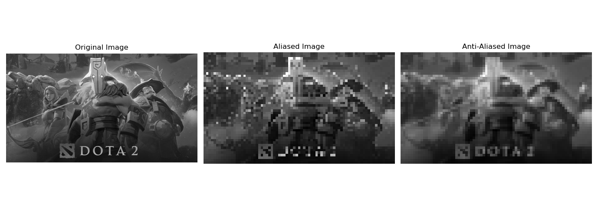

# Anti-aliasing Fitier

## what is the aliasing? and why it happened?

- Practical signals have infinite frequency extent(i.e. Bandwidth)
- No sampling rate is high enough
- Frequencies above the folding frequency ($f_{2}$/2) "Fold" or Alias To different frequecy.

<figure>
  
  <figcaption>Plot showing aliasing of an undersampled 1D sinusoidal signal. The blue dots are the digital samples taken to record the red signal. Clearly, they are not enough to reconstruct the original signal: from then on, only the blue, wrong signal can be interpolated.</figcaption>
</figure>

Therefore, it needs anti-aliasing filter applied to an image before it is resampled (downscaled)。 

## How anti-aliasing filter worked?

The main idea is that, the filters remove high-frequency content (usually above $f_{2}$/2) from the original image reducing its Bandwidth. Therefore, the lower Sampling Density in the downscaled image is still above the Critical Sampling Distance.

<figure>
  
  <figcaption>In image processing, aliasing is the jagged appearance of bending lines or diagonal lines. The shape of a pixel is square. So it cannot adjust well with the changing curve. Instead of being continuous as the line is, it changes its curvature in steps as shown in below figure
</figcaption>
</figure>

```python
import numpy as np
import matplotlib.pyplot as plt
import matplotlib.image as mpimg
from scipy import ndimage
import os

image_path = 'Image Processing/assets/dota.png'
image = mpimg.imread(image_path)

if image.ndim == 3:  
    image = np.dot(image[..., :3], [0.2989, 0.5870, 0.1140])

# Function to downsample the image to induce aliasing
def downsample(image, factor):
    print(len(image[::factor, ::factor]))
    return image[::factor, ::factor]

# Function to apply Gaussian filter for anti-aliasing
def antialias(image, sigma):
    return ndimage.gaussian_filter(image, sigma=sigma)

# Downsample the image (high factor can increase aliasing)
factor = 8
aliased_image = downsample(image, factor)

# Apply Gaussian filter before downsampling to reduce aliasing
smoothed_image = antialias(image, sigma=3)
anti_aliased_image = downsample(smoothed_image, factor)

# Plotting
fig, axes = plt.subplots(1, 3, figsize=(15, 5))
axes[0].imshow(image, cmap='gray')
axes[0].set_title('Original Image')
axes[0].axis('off')

axes[1].imshow(aliased_image, cmap='gray')
axes[1].set_title('Aliased Image')
axes[1].axis('off')

axes[2].imshow(anti_aliased_image, cmap='gray')
axes[2].set_title('Anti-Aliased Image')
axes[2].axis('off')

plt.tight_layout()
plt.show()
```

output:


